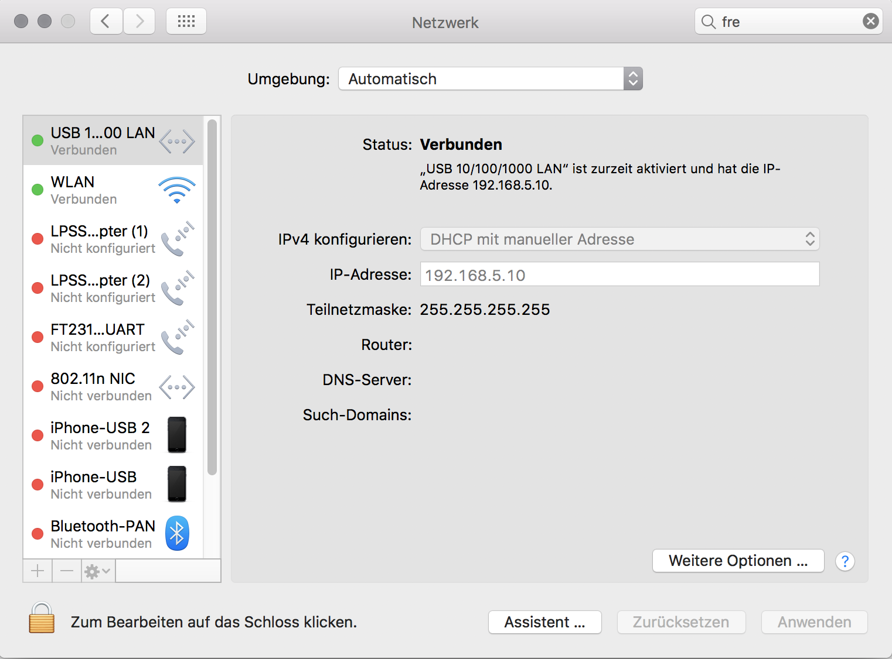
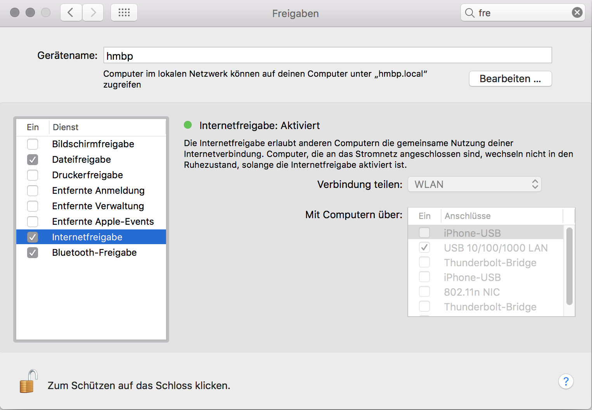

# Unboxing server

## setup
````
npm install
meteor
````

## setup router connection
### 1. (once)

````
sudo defaults write /Library/Preferences/SystemConfiguration/com.apple.nat NAT -dict-add SharingNetworkNumberStart 192.168.5.100
sudo defaults write /Library/Preferences/SystemConfiguration/com.apple.nat NAT -dict-add SharingNetworkNumberEnd 192.168.5.255
sudo defaults write /Library/Preferences/SystemConfiguration/com.apple.nat NAT -dict-add SharingNetworkMask 255.255.0.0
````
### 2.
set your ethernet ip to 192.168.5.10


### 3.
enable network sharing to ethernet

